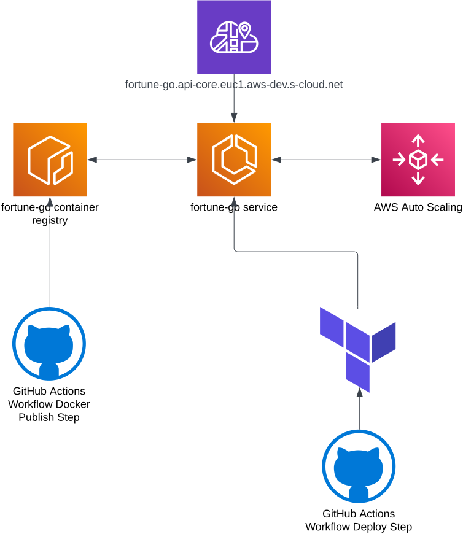

# Fortune

A random quotes service.

This repository showcases a minimal implementation of an idiomatic production ready system. It demonstrates a recommended way to set up and structure a deployment pipeline.

## Further Resources

### Fortune
- [CI pipeline history](https://github.com/patrickisgreat/pb-go-api-starter/actions)
- [Newrelic dashboard](https://one.newrelic.com/nr1-core/open-instrumentation-explorer/summary/NDE2ODgxNnxFWFR8U0VSVklDRXwtNDI4NDAyMTc2Njc0NTY2MTUwNA?account=4168816)

## Endpoints

Fortune exposes its core functionality as a [twirp service](https://github.com/twitchtv/twirp/blob/master/PROTOCOL.md).

Sample curls:

`curl -i -X POST -H "Content-type: application/json" http://localhost:8000/twirp/proto.patrickisgreat.pb_go_api_starter.api.Fortune/GetCookie --data '{}'`

`curl -i -X POST -H "Content-type: application/json" http://localhost:8000/twirp/proto.patrickisgreat.pb_go_api_starter.api.Fortune/GetCookieFlaky --data '{}'`

`curl -i -X POST -H "Content-type: application/json" http://localhost:8000/twirp/proto.patrickisgreat.pb_go_api_starter.api.Fortune/GetCookieLate --data '{"delayMs": 2000}'`

## Prerequisites

* [install go](https://go.dev/doc/install)
* install task `go install github.com/go-task/task/v3/cmd/task@latest`
* install dependencies `task deps:macos` (for macos), `task gen:rpc` (rpc generation) and `task install` (general library dependencies).

## Running the App

1. Run `task run`
2. Hit some endpoints (see above)

## Available commands

Run `task --list-all` to see a list of available commands.

## Architecture

