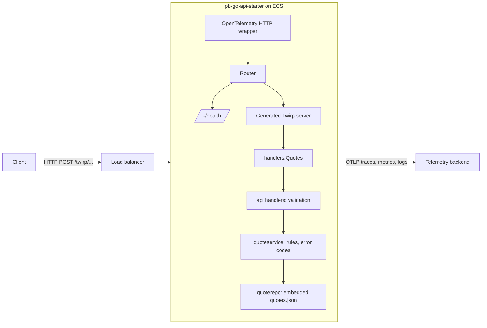

# pb-go-api-starter

A small, production-shaped Go API that serves random quotes.

The service is deliberately tiny so that the surrounding machinery is the point: a
[Twirp](https://github.com/twitchtv/twirp) RPC layer generated from protobuf,
layered packages with clear ownership, unit and end to end tests, hot reload in
development, a distroless container image, OpenTelemetry instrumentation, and
Terraform for AWS ECS. Use it as a template for a new service, or as a worked
example of how the pieces fit together.

New to Go? Start with the [Go learning path](golang-learning/README.md), which
uses this repository as its textbook.

## Contents

- [What it does](#what-it-does)
- [Quick start](#quick-start)
- [Calling the API](#calling-the-api)
- [Project layout](#project-layout)
- [Development workflow](#development-workflow)
- [Testing](#testing)
- [Configuration](#configuration)
- [Deployment](#deployment)
- [Documentation](#documentation)

## What it does

The API exposes one Twirp service, `Quotes`, with three RPCs:

| RPC             | Purpose                                                                 |
| --------------- | ----------------------------------------------------------------------- |
| `GetQuote`      | Return a random quote.                                                  |
| `GetQuoteFlaky` | Return a random quote, but fail about half the time. Exercises alerting. |
| `GetQuoteLate`  | Return a random quote after a delay. Exercises latency alerting.        |

Quotes are embedded in the binary from `internal/quoterepo/quotes.json`, so the
service has no external dependencies at runtime. A health check is served at
`/-/health`.

## Quick start

Prerequisites:

- [Go](https://go.dev/doc/install) 1.23 or newer
- [Task](https://taskfile.dev): `go install github.com/go-task/task/v3/cmd/task@latest`
- Docker, only if you want to build the container image or regenerate the API docs
- Access to the `github.com/soundcloud/gokit/v2` module. It is a private module, so
  set `GOPRIVATE=github.com/soundcloud/*` and make sure `git` can authenticate to
  GitHub before running `go mod download`.

Install the toolchain and generate code:

```sh
task deps:macos   # protoc, golangci-lint, air, goimports, protoc plugins (macOS)
task gen:rpc      # generate Go code from rpc/*.proto into internal/generated
task install      # download Go module dependencies
```

Run the service with hot reload:

```sh
task run
```

The server listens on `localhost:8000` by default. Check it is up:

```sh
curl -i http://localhost:8000/-/health
```

## Calling the API

Twirp routes every RPC as an HTTP `POST` to
`/twirp/<proto package>.<service>/<method>` with a JSON or protobuf body.

```sh
# A random quote
curl -s -X POST -H "Content-Type: application/json" \
  http://localhost:8000/twirp/proto.patrickisgreat.pb_go_api_starter.api.Quotes/GetQuote \
  --data '{}'

# Fails about half the time; pass "fail": true to force a failure
curl -s -X POST -H "Content-Type: application/json" \
  http://localhost:8000/twirp/proto.patrickisgreat.pb_go_api_starter.api.Quotes/GetQuoteFlaky \
  --data '{"fail": true}'

# Waits before answering; omit delayMs for a random 100 to 1000 ms delay
curl -s -X POST -H "Content-Type: application/json" \
  http://localhost:8000/twirp/proto.patrickisgreat.pb_go_api_starter.api.Quotes/GetQuoteLate \
  --data '{"delayMs": 2000}'
```

A successful response looks like:

```json
{"quote": "Simplicity is prerequisite for reliability.\n        ― Edsger W. Dijkstra"}
```

Every request may carry a `userSession`. When `userSession.userUrn` is present it
must be a valid `users` URN, otherwise the RPC returns a Twirp
`invalid_argument` error. The full message and field reference is in
[docs/pb_go_api_starter.md](docs/pb_go_api_starter.md).

## Project layout

```
cmd/app/            main package: wires config, telemetry, handlers and the HTTP server
internal/
  api/              one file per RPC: validation and orchestration
  appserver/        HTTP server lifecycle, router, health check, shared ServerContext
  config/           typed configuration loaded from environment variables
  handlers/         the type that satisfies the generated Twirp service interface
  quoterepo/        data access: the embedded quotes.json and a random picker
  quoteservice/     business logic between handlers and the repository
  generated/        protoc output (git ignored, run task gen:rpc)
rpc/                protobuf definitions
end_to_end/         black box tests that run against a live server
docs/               MkDocs site: architecture, configuration, API reference
golang-learning/    a guided tour of Go using this codebase
terraform/          AWS ECS service, alerts and per environment config
```

A request flows `router -> generated Twirp server -> handlers -> api -> quoteservice
-> quoterepo`. See [docs/architecture.md](docs/architecture.md) for the reasoning
behind each layer.

## Development workflow

Everything is driven by [Task](https://taskfile.dev). `task --list-all` prints
every task; the ones you will use most:

| Task              | What it does                                                 |
| ----------------- | ------------------------------------------------------------ |
| `task run`        | Build and run with hot reload via `air`                      |
| `task build`      | Regenerate RPC code and build `cmd/app/bin/pb-go-api-starter` |
| `task gen:rpc`    | Run `protoc` for `rpc/*.proto`                               |
| `task gen:docs`   | Regenerate `docs/pb_go_api_starter.md` from the proto files  |
| `task format`     | `goimports` with local import grouping                       |
| `task lint`       | `golangci-lint`                                              |
| `task test`       | Tidy, lint, vet, then run unit tests                         |
| `task test:e2e`   | Build, start the binary, run the end to end tests            |
| `task upgrade`    | Bump all dependencies                                        |

Changing the API is a four step loop: edit `rpc/pb_go_api_starter.proto`, run
`task gen:rpc`, implement the new method on `handlers.Quotes`, add tests.
The compiler will tell you exactly what is missing.

## Testing

- **Unit tests** live next to the code they test and use
  [quicktest](https://github.com/frankban/quicktest). Handlers are tested by
  building a `ServerContext` with a repository containing a single known quote.
- **End to end tests** in `end_to_end/` start the compiled binary and make real HTTP
  requests. Point them at a deployed instance with `API_HOST` and `API_PORT`;
  `ENV=development task test:e2e:ci` does this using `.env/.env.development`.
- `task test:coverage` opens an HTML coverage report.

## Configuration

Configuration is read from environment variables. `Task` loads
`.env/.env.<ENV>` followed by `.env/.env.local`, so `ENV=test task test` and
`task run` (which sets `ENV=local`) pick up the right file automatically.

| Variable                | Meaning                                                        |
| ----------------------- | -------------------------------------------------------------- |
| `APP_NAME`              | Service name used in logs and telemetry                        |
| `HOST` / `PORT`         | Listen address (`localhost:8000` in the local and test env files) |
| `ENVIRONMENT`           | `local`, `test`, `development`, `staging` or `production`      |
| `LOG_LEVEL`             | `debug`, `info`, `warn` or `error`                             |
| `LOG_PRETTY`            | `true` for human readable logs instead of JSON (default `false`) |
| `OTEL_SDK_DISABLED`     | `true` turns off OpenTelemetry export (set in local and test)  |
| `API_HOST` / `API_PORT` | Target for the end to end tests when not running locally       |

In deployed environments the OpenTelemetry exporter settings are injected by
Terraform; see [docs/configuration.md](docs/configuration.md).

## Deployment

`Dockerfile` is a two stage build that produces a static binary on a `scratch`
image. `terraform/` defines an ECS Fargate service and its alerts, with one
`config/<environment>/` directory per target account. The
[deployment guide](docs/deployment.md) walks through building the image, pushing to
ECR and applying Terraform.

Links:

- [CI pipeline history](https://github.com/patrickisgreat/pb-go-api-starter/actions)
- [New Relic dashboard](https://one.newrelic.com/nr1-core/open-instrumentation-explorer/summary/NDE2ODgxNnxFWFR8U0VSVklDRXwtNDI4NDAyMTc2Njc0NTY2MTUwNA?account=4168816)

## Documentation

The `docs/` directory is a [MkDocs](https://www.mkdocs.org) site published through
Backstage TechDocs. Serve it locally with `mkdocs serve` after
`pip install mkdocs-material mkdocs-techdocs-core mkdocs-git-revision-date-localized-plugin`.

- [Getting started](docs/getting-started.md)
- [Architecture](docs/architecture.md)
- [API guide](docs/api.md) and the generated [proto reference](docs/pb_go_api_starter.md)
- [Configuration](docs/configuration.md)
- [Testing](docs/testing.md)
- [Deployment](docs/deployment.md)
- [Go learning path](golang-learning/README.md)

## Architecture


