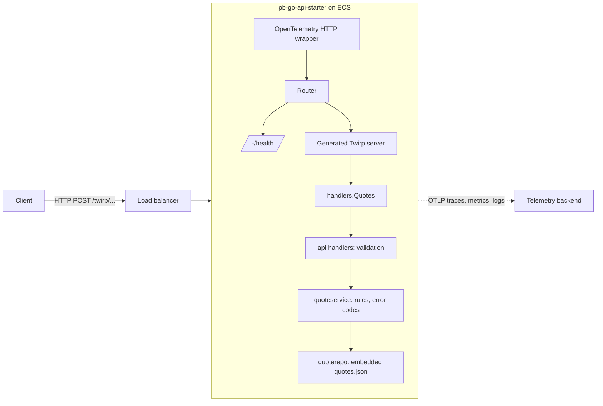
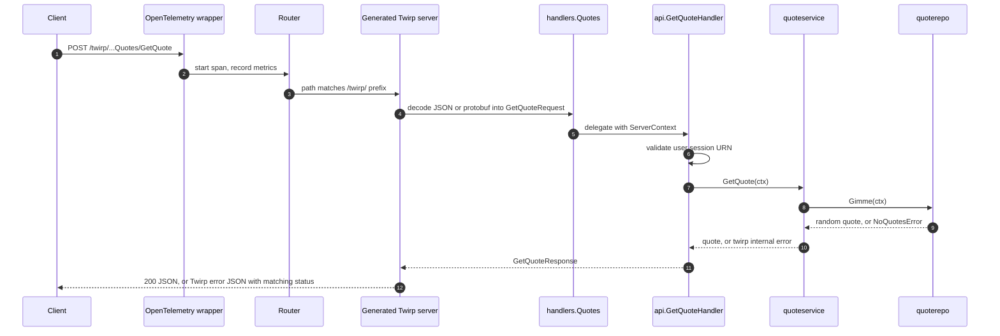

# Architecture

## Request path

Every layer only knows about the one below it. Nothing imports `handlers` except
`main`, nothing imports `api` except `handlers`, and so on down.

## Packages

### `cmd/app`

The only `main` package. It is deliberately short: initialise the shared
`ServerContext`, construct the Twirp server, wrap it in instrumentation, and start
the HTTP server. There is no logic here to test.

### `internal/appserver`

Owns the process lifecycle.

- `context.go` builds the `ServerContext`, a plain struct holding the repository
  and service. It is created exactly once through `sync.Once`, after OpenTelemetry
  and configuration are initialised, because those must exist before anything
  logs.
- `router.go` mounts the Twirp handler at its path prefix and adds `/-/health`.
- `server.go` starts `http.Server` in a goroutine, blocks on `SIGINT` or `SIGTERM`,
  then gives in-flight requests ten seconds to finish before flushing telemetry.

### `internal/handlers`

`handlers.Quotes` is the type passed to the generated `NewQuotesServer`. Its only
job is to satisfy the generated interface and delegate to `internal/api`. Keeping
this separate means the `api` package has no dependency on how the transport
constructs handlers, and the handler type stays a one-line-per-method adapter.

### `internal/api`

One file per RPC. Each handler validates the request (`validation.go` checks the
user URN), pulls what it needs from the `ServerContext`, and calls the service.
Tests here construct a `ServerContext` directly with a repository holding a single
known quote, so they run without a network or the generated server.

### `internal/quoteservice`

The business layer. Today it only converts repository errors into Twirp errors so
that callers receive a proper `internal` error code. As rules accumulate (rate
limiting, filtering, caching) they belong here, not in `api` or `quoterepo`.

### `internal/quoterepo`

Data access. `quotes.json` is compiled into the binary with `//go:embed` and
parsed once at start-up. `Gimme` returns a random entry or a `NoQuotesError`. If
the data moved to a database, only this package would change.

### `internal/config`

A struct embedding `baseconfig.Base` from gokit and adding service specific
fields. `Load` reads environment variables into it. Everything reads
`config.Config` rather than calling `os.Getenv` directly.

### `rpc`

The protobuf source of truth. `pb_go_api_starter.proto` defines the messages and
the `Quotes` service; `common_session.proto` defines the shared `UserSession`
message and is generated into gokit rather than into this repository.

### `internal/generated`

Output of `protoc` with the Go and Twirp plugins. It is git ignored and rebuilt by
`task gen:rpc`, so nobody edits it and merge conflicts are impossible.

## Cross-cutting concerns

**Errors.** Repository and service functions return ordinary Go errors. The
service layer wraps them as `twirp.Error` values, which the generated server
serialises into the standard Twirp error JSON with the right HTTP status.
Validation failures use `twirp.InvalidArgumentError`, which becomes HTTP 400.

**Logging.** `log/slog` via gokit's `logger` package. The logger is attached to
the request `context.Context`, so any function with a context can call
`logger.Get(ctx)` and get trace-correlated structured logs.

**Telemetry.** gokit's `otelsetup` configures the OpenTelemetry SDK from standard
`OTEL_*` environment variables. Locally `OTEL_SDK_DISABLED=true` turns it off.
The Twirp server interceptor creates a span per RPC and the HTTP wrapper records
request metrics.

**Configuration.** Environment variables only, loaded once at start-up. See
[Configuration](configuration.md).

## Why Twirp

Twirp gives protobuf-defined, code-generated clients and servers over plain HTTP
1.1 with JSON or binary bodies. Compared to gRPC it needs no HTTP/2, works with
`curl`, and passes through any load balancer. Compared to hand-written REST it
gives a typed contract and generated docs for free.
